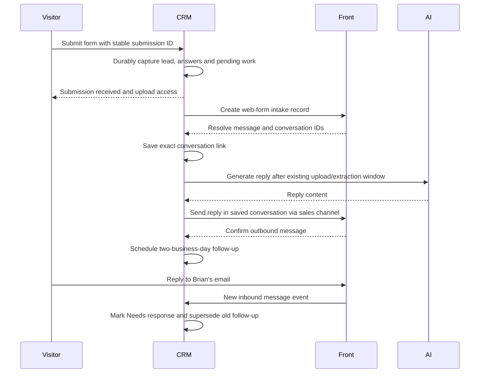

# Front + CRM lead management specification

Implementation is now present in the repository. Deployment and real-provider acceptance remain pending; see the [rollout runbook](../COMMUNICATIONS-RUNBOOK.md). The design below records the reviewed requirements, not a claim of a live connection.
**Status: implementation built; deployment and live acceptance pending.**
Updated September 8, 2026. Front is the default transport for this lead flow.

[Technical design, failure handling, and acceptance criteria](front-crm-integration-technical.md)

[Dialpad calls, shared-line texting, and callback requirements](dialpad-crm-integration.md)

## 1. Confirmed decisions

| Decision | Requirement |
| --- | --- |
| Lead responsibilities | Every lead has a **Salesperson** and a **Deal champion**; the same person may fill both |
| Assignment | Automatically set both roles to the admin-selected default teammate, initially **Brian Cole** in production; any active teammate eligible for both roles may be selected |
| Salesperson | Owns the prospect relationship, sales communication, and prospect follow-up |
| Deal champion | Coordinates carriers and salespeople and drives the work required to get the deal bound |
| Eligibility | Admin controls whether each teammate appears in the Salesperson dropdown, Deal champion dropdown, both, or neither |
| Permissions | Eligibility and lead assignments do not change what a user can see or do |
| Initial AI sender | Always **Brian Cole**, from the shared **sales@protectmyhoa.com** address in production |
| Follow-up | Remind the salesperson after **two business days** without a prospect reply |
| Responding to a prospect | The team's response is due within **one business day** of the first unanswered substantive prospect message |
| Escalation | Escalate to the deal champion after **one overdue business day** |
| Email transport | Front is the new default for website lead intake and initial AI emails; no provider selector or provider environment variable |
| Intake conversation | Replace FormSubmit delivery with a Front intake record and send the AI email in that same conversation |
| Front sidebar | Included in the initial integration scope, with context and actions |
| Front snoozes and cleanup | Personal or shared snoozes and archives do not move CRM deadlines; deadline changes are explicit CRM/sidebar actions |
| Dialpad tracking | Include the shared main line and the team's individual business numbers |
| Prospect texts | Send from the shared Dialpad main line, **(508) 233-2261** |
| Missed prospect calls/voicemails | Callback due within **one business day**, using the same CRM deadline protections |
| Implementation order | Complete and review the specification before building |

Specific operational details below are proposed implementation defaults where
not explicitly chosen above. They are stated so reviewers can change them
without leaving behavior to chance.

## 2. What the team should experience

A website enquiry appears immediately as a lead with a complete form summary.
Its Front conversation contains that submission, Brian's AI reply, subsequent
prospect replies, and the team's outgoing messages. The account links directly
to that conversation, and the Front sidebar shows the account's CRM context.

New leads start with the configured default teammate as both salesperson and deal champion (Brian is the intended production default). The team can
reassign either role. Once all immediate work is handled, the conversation may be archived.
The CRM still lists the lead, its next actions, and deadlines. A prospect reply
returns it to an actionable state; an unanswered outreach generates a due task
and, if neglected, an escalation to the deal champion.

Jake's oversight view shows missing assignments, unanswered replies, overdue
work, and communication failures across the team. Keeping a personal snooze on
every lead is no longer necessary for oversight.

Calls and texts join the lead's CRM history through the
[Dialpad extension](dialpad-crm-integration.md). Call and SMS conversations can
remain separate in Front while sharing the same lead context and commitments.
Phone contact matching must account for property managers with multiple HOAs.

## 3. Responsibilities and Settings

### Settings → Team

Add two independent admin-controlled checkboxes for each existing teammate:

- **Available as salesperson**
- **Available as deal champion**

A teammate can have either, both, or neither. These are assignment eligibility
settings. Existing ADMIN/STAFF/PRODUCER access rules remain independent.
A user who is eligible for neither can still view and act on leads to the
extent their existing CRM permissions allow.

Dropdowns list enabled teammates eligible for the corresponding responsibility,
using stable user IDs with their display names. Email addresses, names, and
free-text website labels are not assignment keys. Admin changes are audited.
Enforce admin-only eligibility writes on the server, not just in the interface.

Turning eligibility off removes a person from new choices but retains existing
assignments and their history. Show an existing selected value with an
explanation if it is no longer eligible. Disabling the person's account also
creates a reassignment exception for their active leads and tasks; it must not
silently delete their responsibilities.

### Assigning a lead

Show both selectors together on the account and in the Front sidebar. Team
members with existing lead-edit rights can assign or reassign either role.
Saving both is one audited operation. Same-person assignments are valid and
must not produce duplicate reminders.

Automatically populate both roles with the admin-selected teammate's verified CRM
user ID during new-lead creation. Brian remains the intended production default,
but this is a configurable choice, never a name-based restriction. Any active
CRM teammate enabled for both roles may be selected, including Jake in staging.
Manual creation forms show the configured default in both selectors and allow
the team to choose different eligible people before saving. Public forms cannot
choose staff. Technical retries never overwrite later team assignments.

Configure the selected teammate as eligible for both roles at setup. If the default
cannot be applied because the account is missing, disabled or ineligible,
preserve the incoming lead and show an assignment/configuration exception to
admins. Such a lead stays in **Needs assignment** and cannot be auto-archived.
This is an exceptional configuration failure, not the normal intake workflow;
the earlier proposed one-day unassigned-lead alert is superseded by automatic
assignment.

Brian's initial AI acknowledgement still follows the existing reply window.
If an exceptional lead has due work before its assignments are repaired, that
work remains visible and cannot be marked delivered to a missing assignee.
Reassignment preserves the original deadline rather than granting a new delay.

During migration, fill missing roles on existing active leads with the configured default while
preserving any explicitly recorded assignments. Never infer responsibility from
an old email subscription or a website "Assigned agent" label. Roles remain on
the account when binding converts it to a client, preserving attribution and
continuity.

### Front's current assignee

Front's conversation handler is distinct from these two lead responsibilities.
Initially route the prospect conversation to its salesperson once assigned.
Carrier conversations default to the deal champion when explicitly linked.
The sidebar always displays both lead roles and the current Front assignee.

Changing the assignee in Front changes the current conversation handler only.
It does not rewrite either lead role. Changing a role in the CRM can update
conversations still following that role's routing; preserve an explicit manual
conversation-handler override. The sidebar offers an explicit **Use salesperson**
or **Use deal champion** routing action to resume role-based assignment.

## 4. Replace FormSubmit and keep one conversation

Yes, the form notification can use Front. The proposed implementation replaces
FormSubmit's delivery step with a direct representation of the submission in
Front. Front documents web-form imports and sending a reply in an existing
conversation. This gives us an explicit conversation link instead of relying on
matching email subjects. Sources: [Import message](https://dev.frontapp.com/reference/import-inbox-message),
[Create message reply](https://dev.frontapp.com/reference/create-message-reply).

The intake record is explicitly labelled **Website submission** with form source,
server capture time, association/property, contact details, and all relevant
answers. It is an internal representation of what the visitor submitted, not
an additional email sent to the visitor. Internal routing notes, AI instructions,
credentials, and staff-only commentary are kept out of the customer-facing body
and quoted history.

The outgoing AI email explicitly targets the submitted, validated contact email
and uses the shared sales channel. No recipient is inferred from a FormSubmit
sender address. No BCC to sales is needed. There is one signature and one
actual initial email to the prospect.

A technical retry of the same submission reuses its lead and conversation.
A genuinely new enquiry from the same property manager must not be collapsed
into a prior association's thread. Unknown or ambiguous existing records are
presented for linking by the team. Historical thread merging is not required
for new intake to work correctly.

### All website entry points

Replace the FormSubmit step in every current lead form:

| Form | Preserve |
| --- | --- |
| Quote wizard, including unit-owner branch | Role, contact, association, both address lines, requested coverages, incumbent carrier, expiry, unit count and HO-6 answers |
| Contact form | Contact details and complete enquiry text |
| Instant assessment | Name, email, phone, property, state, unit count and original source |
| Coverage calculator | Address, state, unit count and coverages shown, including priorities |
| Association-page HO-6 form | Association, Buildium/property identity, unit, contact, incumbent carrier and notes |

Use a common submission contract with a versioned source-specific answer
snapshot. Preserve useful fields that currently exist only in the notification
payload. Labels are rendered server-side; arbitrary browser HTML is not trusted.
The website must no longer fire independent CRM and email requests.

A success screen means the submission is durably saved. Front downtime may
leave notification/email work pending but must not lose the enquiry. A storage
failure shows a retryable form error while keeping the entered answers. Browser
retries use the same submission ID. Existing SMS opt-ins remain in effect and
are triggered once per accepted submission.

## 5. Initial AI email and subsequent communication

Retain the current upload window, document reading, reply quality rules, and
upload-portal behavior. Transport changes do not remove that document context.
The AI generator always uses Brian's greeting/sign-off identity. Assigning
another salesperson later does not rewrite the message already sent.

Front is the only transport for this flow after cutover. AWS still hosts the
CRM workers and data. Credentials remain in a server-side secret store;
that requirement is separate from choosing an email provider. Non-secret Front
company/inbox/channel mappings belong in admin integration settings, with
separate production and staging configuration.

AI sends wait for the intake conversation to be resolved. If Front is unavailable,
retain and retry safe pending work, show **Email delayed**, and alert on an aged
backlog. Do not create a second conversation or switch silently to SES. If a
person has already replied to the prospect during the AI waiting window, suppress
the redundant AI send and record why; human activity takes precedence.

Inbound and outgoing human messages update the CRM timeline and follow-up state.
Attachments arriving by email are listed with their Front message and can be
saved to the existing CRM document workflow; do not automatically trigger
extraction or carrier submissions merely because an attachment arrived.
Later website uploads add a document-arrival note/link to the existing Front
conversation, grouped per completed upload batch, instead of creating a separate
notification thread. The existing secure upload portal remains the file source.

Human email remains composed and sent in Front. The sidebar can open the relevant
conversation or draft a reply, but it does not introduce unattended AI follow-up
sequences or automatic binding.

## 6. Follow-ups, reminders and escalation

Create an explicit prospect follow-up from the last confirmed substantive
outbound email. The confirmed default is **two business days** if the prospect
has not replied. "Accepted by Front" alone does not start the clock.

Proposed calendar definition: America/New_York; Monday–Friday excluding dates
on an admin-maintained agency holiday calendar. Schedule the default reminder
at 9:00 a.m. on the second business date after the sent date. Thus a Friday
email is due Tuesday morning without holidays. Escalation occurs at 9:00 a.m.
on the next business date after the due date. Custom commitments can use an
exact date/time and take precedence over this default. Store times in UTC and
display them locally. Holidays are not inferred from the user's device.

Reminders are CRM tasks/in-app notifications, with the relevant Front
conversation reopened or surfaced when due. Escalation is a distinct notification
to the deal champion; the salesperson remains responsible for prospect follow-up.
If both roles are the same person, show one task with escalated urgency. Do not
create a new outbound customer email for either reminder.

The deal champion can also have independent carrier, document, or binding tasks.
Multiple actions can coexist on a lead; each has one responsible role/person,
due date, state, and completion reason. Carrier tasks do not reset the prospect's
reply clock. Changing the salesperson or champion carries their open role-based
tasks to the replacement and preserves original due dates.

A human inbound reply supersedes the current no-response follow-up and creates
**Needs response**. It does not close the lead. Auto-replies and out-of-office
messages are recorded but do not count as a substantive reply; uncertain
classification is shown for human review. An explicit callback date or an agreed
prospect deadline overrides the standard cadence and is preserved until the
team changes it.

The **Needs response** action has a confirmed **one-business-day** response
deadline, separate from the two-day no-response follow-up. Start it from the first unanswered
substantive prospect message. Additional messages must not push that deadline
out. An internal comment, a Seen event, or an archive does not count as a reply.
Use the existing overdue-work and champion-escalation
rules for a late response, with no duplicate task for the same unanswered episode.

Completing a task while the lead remains active requires another next action,
a documented waiting commitment, or an outcome. Leads cannot disappear simply
because someone clicks Complete. A Seen signal does not complete or postpone
any task. When bound, lost or disqualified, close obsolete prospect actions with
a recorded outcome. Binding itself still uses the CRM's existing validated
quote-to-policy workflow. Reopening a lost/disqualified lead requires restoring
both responsibilities and an actionable plan.

## 7. Inbox rules and personal views

Cleanup is automatic whenever the integration is activated and delivery is running.
There is no separate cleanup setting; previously saved off values have no effect.
The delivery pause still pauses provider changes, including cleanup.

Auto-archive a prospect conversation only when:

1. The correct CRM account and conversation are linked.
2. Both lead responsibilities are assigned to available teammates.
3. There is no unresolved inbound message or current due action for it.
4. Its next action/commitment is durably recorded, or the deal has a recorded
   terminal outcome and no remaining conversation work.
5. There is no uncertain send, routing error, or unresolved sync gap.

Save CRM state before requesting a Front status change. A failed archive is a
visible synchronization issue, not a failed task save. Before applying a queued
archive, re-check conversation activity and the CRM action version. If a reply
races the change, inbound processing reopens it; never let an old queued archive
permanently bury newer work.

A person may use Front's ordinary archive/snooze controls. Those actions never
complete a CRM task. Record conversation status separately; the CRM deadline
remains authoritative. Changing the sales deadline is an explicit sidebar/CRM
action with a reason, preventing two hidden follow-up clocks.
This is a confirmed decision for both personal and shared-inbox cleanup.

Front separates shared and personal conversation status. The cutover must test
the shared Sales inbox, assigned views, and Jake's subscribed view. Do not promise
that one API archive clears every personal copy. Review legacy subscriptions
and snoozes after ownership coverage is verified; do not bulk remove them first.
See [Front's status behavior](https://help.front.com/en/articles/2134).

## 8. CRM views and Front sidebar

### CRM

The lead/account header displays Salesperson, Deal champion, next prospect
follow-up, outstanding champion work, communication health, and **Open in Front**.
Lists support filters by either responsibility and **My leads** means either
role, as a convenience filter only.

Team views: **Needs assignment**, **Needs response**, **Due today**, **Overdue**,
**Waiting on prospect**, **Champion work**, and **Communication issues**.
Show the oldest unresolved inbound time and latest substantive outbound time.
Do not collapse "no receipt" and "not yet checked" into "unread".

### Front sidebar: HOA CRM

A focused, responsive panel includes:

- Account/contact identity, form source and initial submission summary.
- Salesperson and Deal champion selectors, plus current conversation handler.
- Next action, due date, overdue/escalated state and responsibility.
- Incumbent expiry, requested coverage, quote progress, and outstanding documents.
- Email status, Seen signal with last-checked time, and sync health.
- Actions: assign/reassign, add/update/complete a task, set a callback date,
  add an internal note, save an email attachment to the CRM, link a conversation,
  open the account, or open the existing quote/bind workflow.

Selecting an unlinked conversation offers search and explicit linking, with
candidate matches explained. Same email alone is not sufficient to auto-link.
For no selection or multiple conversations, show a clear state and avoid edits
against an accidentally retained previous account. Unsaved changes remain
associated with their original conversation; context switches must not apply
an edit to the newly selected lead.

Both applications call the same validation and mutation handlers. The sidebar
uses existing CRM authentication and authorizes actions against the signed-in
user. Being present in Front is not CRM authorization, and eligibility checkboxes
are not access controls. No Front token or upload bearer token is sent to it.

Front supports hosted sidebar applications with conversation context. Use its
SDK's navigation mechanism for opening the CRM from the embedded panel.
Sources: [Plugin overview](https://dev.frontapp.com/docs/plugin-overview),
[Plugin FAQ](https://dev.frontapp.com/docs/plugin-faq).

## 9. Read receipts

Enable **Track sent emails** on the shared sales channel and retrieve Seen
receipts for the actual outbound message IDs. Display the earliest Seen signal,
recipient identity when available, and when data was last checked. Image blocking
may prevent a signal and privacy proxies may generate one automatically. These
are engagement hints, not verified reading, proof of delivery, or task completion.
Sources: [Front tracking](https://help.front.com/en/articles/2034),
[Seen receipt API](https://dev.frontapp.com/reference/get-message-seen-status).

Poll recent active-lead messages on a bounded schedule and allow an on-demand
refresh with rate limiting. No continuous scan of all historical email.

## 10. Cutover and completion

Implement this as one specified integration, delivered in internal milestones:
responsibilities/tasks; reliable capture and Front threading; event synchronization
and reminders; sidebar; Dialpad activity and callbacks; migration and operational
validation. FormSubmit is removed
only when the durable replacement and customer-facing error flow work end to end.
There is no long-term dual provider option.

Backfill missing roles on existing active leads with the configured default, preserving explicit
assignments. Identify relevant Front conversations in a review list and retain
existing follow-up commitments before
changing their inbox status. Do not resend initial AI emails to historical leads.
Source and form-submission IDs distinguish new intake from migration work.

Staging uses separate Front inbox/channel mappings and controlled recipients.
A production channel cannot be accepted as staging configuration accidentally.
Verify the connected account's import/reply/threading, tracking, rule behavior,
SDK login and personal inbox effects before production cutover. Front credentials
and exact channel IDs are deployment prerequisites, not unanswered product choices.

Completion means a form produces one CRM lead and one linked Front conversation;
the team can assign both responsibilities and manage due work from either UI;
replies and failures are visible; reminders survive archiving; and no eligible
active lead is silently omitted from oversight. Detailed tests and outage
requirements are in the technical appendix and Dialpad extension. Dialpad
completion also verifies configured main/individual-number coverage, shared-line
texting, correct activity linking and callbacks that survive inbox cleanup.

## 11. Final operational decisions

Brian as the intended production default for both roles (admin-configurable, with manual reassignment), the
2-business-day / 1-overdue-business-day cadence, Brian as initial sender, and
keeping CRM deadlines independent of Front snoozes are confirmed. Automatic
assignment replaces the earlier choice of manual initial assignment and the
unassigned-lead alert question.

The team must respond to a substantive prospect reply within **one business
day**. For example, a substantive reply received Tuesday at 10:00 a.m. would be
due Wednesday at 10:00 a.m., assuming normal staffed days and no holiday. This
does not send an automatic email; it marks the team's response task overdue.
It is distinct from the confirmed two-day follow-up when the prospect is silent.

The main line and individual business numbers are included in Dialpad tracking;
prospect texts use shared (508) 233-2261; missed prospect calls and voicemails
require a callback within one business day. The supplied Front screenshot shows
Dialpad enabled; actual voice/SMS connections and API access require setup checks.

All identified business workflow questions, including Dialpad scope, are resolved. The specification is
ready for final review; this does not authorize starting implementation.

Routine defaults remain explicit for review: 9:00 a.m. scheduled follow-up
reminders, America/New_York, an agency holiday calendar, and grouped document
updates in the existing conversation. For response SLAs measured in
working time, proposed staffed hours are 9:00 a.m.–5:00 p.m. on business days;
one business day is eight staffed hours, and the clock pauses outside them.
These defaults are recommendations, not additional confirmed user selections.
