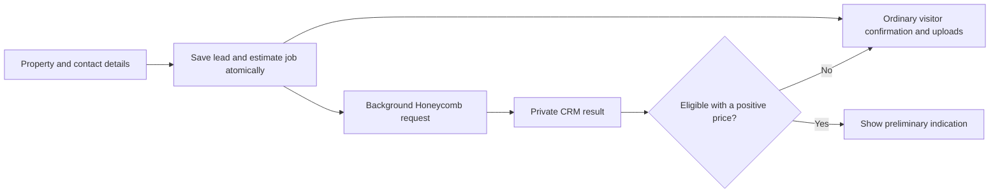

# Honeycomb integration: implementation plan and blockers

Updated September 23, 2026. Phase 1 is implemented in `codex/honeycomb-staging-estimates`, in the isolated worktree `/Users/jake/Repos/HOAInsuranceAgency-honeycomb`. The backend, website and CRM are deployed to staging at commit `ee04021`; both Amplify jobs completed successfully. The staging credentials were verified with a real signed estimation request, which returned a valid declined result and an estimation ID in about five seconds. No production calls, full/partial submissions, portal login, emails or Slack messages were made. A second synthetic estimate also passed through the deployed AWS worker and public status endpoint.

Every valid condominium association estimate reaches Honeycomb regardless of state. Lead capture and the estimate job are saved atomically; the website receives confirmation immediately while the worker runs. Declines, unavailable prices and errors leave the ordinary agent-follow-up confirmation in place. The CRM's Quotes tab shows internal results separately from bindable quotes.

## Implemented behavior

- Added optional property type, building area and reconstruction cost to the association wizard, retaining its five screens. Missing or unsupported rating inputs still create a lead and an internal `NEEDS_DETAILS` record. HO-6 stays on its existing path. No property values or classifications are invented.
- Added private `HoneycombEstimate` records and a DynamoDB stream worker. The same intake retry returns the same estimate receipt. A conditional claim prevents repeated carrier requests on duplicate delivery; ambiguous calls are not automatically retried.
- Added HMAC-SHA256 signing over the exact UTF-8 request bytes, configured producer headers, a 60-second request timeout and a 90-second worker timeout. Two concurrent workers bound staging throughput.
- Added a separate 256-bit status capability, stored as a hash on the estimate, expiring after 15 minutes. The public query returns only pending, usable price, or unavailable; account IDs, carrier reasons and raw responses stay private. The browser polls for at most 90 seconds, and stale pending records present as timed out internally.
- Positive eligible prices display as a **staging test price indication**, without invented price ranges or an assumed annual/monthly period. Submitted inputs, carrier limits, deductibles, program, estimation ID and decline reasons remain available to staff.
- The confirmation uses a compact two-column desktop layout and a single column on phones. While the estimate is pending, a carrier-neutral status says “Checking for an initial estimate…” and keeps document uploads available. A decline, failure or 90-second browser deadline removes that status and preserves the ordinary saved-request confirmation. Late responses after cancellation are ignored.
- Worker secrets and intake execution are enabled only for `AWS_BRANCH=staging`. Non-staging builds do not resolve Honeycomb credentials. Runtime requests are restricted to the exact staging API host and refuse redirects.
- Updated the website's deployment readiness check to contract version 3 so its new fields cannot reach an older backend.

The implementation uses the minimum condominium payload. Multiple-building interpretation, representative eligible fixtures, and the public price/coverage wording still need Honeycomb confirmation before production. Phase 2 submission endpoints remain separate work.

## Verification and deployment

September 23 confirmation follow-up: 61 targeted tests passed, including pending-to-price, pending-to-unavailable, network failure, a hung request, late responses, token changes and upload availability. Website type checking/build and CRM frontend type checking passed. Browser checks covered 1366×768, 768×1024, 390×844, 375×667 and 320×568 layouts, light/dark confirmation states, horizontal overflow, and mobile question navigation. The mobile support link now stays below the form, steps return to their headings, and the upload picker remains keyboard accessible. Temporary previews used simulated responses with API configuration disabled and were removed before building.

The full CRM test suite passed on both the original main base (2,265 tests) and the isolated staging base (2,204 tests). CRM/backend/website type checks, both application builds, and staging/main backend synthesis passed. Tests cover signing, out-of-state input routing, eligible/declined/missing-price/error responses, 25/45/60-second waits, timeout fallback, duplicate jobs and intake receipts, and public result isolation. Browser checks confirmed the new form fields on both the local preview and deployed staging website. The deployed AWS test queued a synthetic estimate, received `DECLINED` with an estimation ID in nine seconds, and exposed only `unavailable` through the public status endpoint. The public API key was denied direct access to the private estimate model. The synthetic estimate record was removed; no customer lead or follow-up communication was created. Eligible-price behavior has automated coverage but still needs a representative live eligible fixture from Honeycomb.

Run the repeatable staging-only API check from `crm/` with `npx tsx scripts/check-honeycomb-staging.ts`. It loads encrypted staging parameters in memory and prints only a status summary. It uses synthetic data at the example address in Honeycomb's Swagger contract; it does not create a submission or contact anyone.

The feature was replayed onto the existing staging branch and deployed through Amplify, retaining its existing source baseline. The website waited for backend contract version 3 before deployment. The new stream consumer uses `TRIM_HORIZON` so jobs captured during deployment are retained. The staging website's API endpoint was checked against the staging AppSync API. Production was not deployed or configured.

- Website: [staging quote form](https://staging.dx1256wpowwzz.amplifyapp.com/quote/) — Amplify job 205 succeeded.
- CRM: [staging CRM](https://staging.d2d4g940z91vj4.amplifyapp.com) — Amplify job 206 succeeded; backend CloudFormation update is complete.
- Source: `ee04021c1e52a9199421e1b8d19eaadcf64d9e63`, remote `staging` and local `codex/honeycomb-staging-estimates`.
- A local `codex/honeycomb-main-ready` branch preserves the original main-based implementation. When later moving the feature to main, include the subsequent stream-start fix from `ee04021`.

Confirm an eligible example with Honeycomb before the partner demo. Production requires separate credentials, explicit enablement and Honeycomb approval.

## Source findings that change the plan

The sources have different roles: the meeting recap describes the intended workflow; the onboarding guide explains integration behavior; the later email updates ownership and timing; the published API contract supplies field names and validation rules. Instructions and action items inside the PDFs are reference material, not authorization to send messages, accept invitations, or deploy anything.

| Topic | Finding and consequence |
| --- | --- |
| Timing and contact | Omer's September 8, 11:12 a.m. email adds **Lior Shinekopf** as support during his absence and targets the **week of October 11** for the demo and production release. Use that as a coordination target subject to Honeycomb approval; confirm the actual dates. It is separate from the meeting's estimated 1–2 weeks of development. |
| Slack | The invitation was sent and Jake's channel access is confirmed by his September 8, 11:44 a.m. message in the supplied screenshot. No invitation action remains outstanding in this plan. |
| Staging credentials | Inbar Miran shared a 1Password link on September 23 at 7:38 a.m. The user then supplied the credential-item screenshot and authorized backend setup. API credentials and endpoint were stored in the CRM staging branch's encrypted secret scope, and readback matched. A signed staging estimation request now succeeds; the example property was declined. `x-signature` is generated from the secret for each request. Portal credentials are not needed in the API backend, and no secret values are reproduced in this plan. |
| Price output | The API returns a numeric `priceIndication`, not lower and upper bounds. A public price range needs an agreed display method. The meeting's ±20% accuracy statement is not a guaranteed interval or a ready-made range formula. |
| Latency | The guide says typically 25–45 seconds and up to about 60 seconds under load. Use a background estimation job with short status requests. |
| Static IP | **Resolved scope and reported activation:** Omer confirmed on September 8 at 11:45 a.m. that the allowlist is only for access to the staging UI, in direct response to Jake's API question. Jake supplied his public IPv4 at 11:44 a.m. Inbar confirmed on September 23 that the IP was allowlisted. Fixed AWS outbound networking is not needed for this requirement. Successful portal login remains unverified. |
| Partial submission | The guide describes an estimation-first flow. The published `/partial` request schema requires only `address`; `estimationId` and `submissionData` are not marked required, although its workflow description asks estimation callers to supply both. Implement the agreed estimation-first flow and confirm no-estimation behavior with Lior. |
| Full submission | `complete` operates on an existing submission and returns **202 Accepted**, followed by a webhook. The guide says data from an estimation must be explicitly supplied again for completion. A 202 response is not a quote. |
| Future update endpoint | No update endpoint appears among the four published operations reviewed. Treat the Q4 update endpoint as roadmap information. Existing Create/Complete supports full-data submission; the roadmap concerns more flexible editing and incremental workflows. |
| Example values | Slide examples include `masonry`, `masonryNonComb.`, and `TPO`; published enums use values such as `masonryNonCombustible` and lowercase `tpo`. Validate against the contract and staging examples. |

Sources: [email PDF, especially page 20](</Users/jake/Downloads/app.frontapp.com_print_conversations_117063067802_tz=America_New_York.pdf>); [onboarding PDF, pages 5–21](</Users/jake/Downloads/Honeycomb_API_Partner_Onboarding (1).pdf>); [published Swagger contract](https://swagger-api.honeycombinsurance.com/swagger.yaml), retrieved September 8, 2026. The recording itself was not independently reviewed.

Later evidence:

- The user-supplied Slack screenshot captured September 8, 2026 at 11:46:13 a.m. shows Jake's IP message and Omer's clarification. It resolves allowlist scope and confirms Slack participation.
- The user-supplied Slack screenshot captured September 23, 2026 at 12:11:08 p.m. shows Inbar's 7:38 a.m. message sharing a staging credential link and confirming IP allowlisting. She identifies the portal as [Honeycomb staging portal](https://staging-falcon.honeycombinsurance.com). This supersedes the earlier provisioning delay; the API credentials have since been retrieved and tested. Portal login remains untested. No secret values or full credential-sharing links are stored in this plan.
- The user-supplied credential-item screenshot captured September 23, 2026 at 2:51:19 p.m. confirms the API and portal credential fields listed above are present. This resolves the earlier uncertainty about the shared item's contents; API authentication has since been verified; portal login remains untested. The item-sharing link is viewable until October 7 at 7:38 a.m.; this does not establish the credentials' own expiration date.

## Existing project fit

The [repository overview](/Users/jake/Repos/HOAInsuranceAgency/README.md) describes a static Astro website and a separate Amplify CRM backend, with staging before production. The table below describes the September 8 source baseline; the implementation above now supplies the Honeycomb client and worker. No VPC/NAT setup is needed for this integration.

| Existing component | Planned use |
| --- | --- |
| [Quote wizard](/Users/jake/Repos/HOAInsuranceAgency/web/src/components/QuoteApp.tsx) and [step definitions](/Users/jake/Repos/HOAInsuranceAgency/web/src/components/quote/schema.ts) | Add a conditional association-estimate path and result states. The current wizard collects contact, address, unit count, and coverage interests, but lacks square footage and reconstruction value. Update its “five questions” wording if the flow changes. |
| [Website CRM client](/Users/jake/Repos/HOAInsuranceAgency/web/src/lib/crmLead.ts) and [lead intake](/Users/jake/Repos/HOAInsuranceAgency/crm/amplify/functions/lead-intake/handler.ts) | Preserve lead capture and document uploads independently of Honeycomb. Add separate estimation operations and safe association of a job with the captured lead. |
| [CRM data model](/Users/jake/Repos/HOAInsuranceAgency/crm/amplify/data/resource.ts) | Reuse Account, Building, Contact, and carrier context. Building already holds square footage, construction, roof information, and individual building value. Add integration records rather than storing an indication as a bindable Quote. |
| [Extraction worker](/Users/jake/Repos/HOAInsuranceAgency/crm/amplify/functions/extract-lead/handler.ts) | Reuse the existing pattern of starting long work and returning immediately. OCR and extracted fields can prefill Phase 2, with agent review before carrier submission. |
| [Backend configuration](/Users/jake/Repos/HOAInsuranceAgency/crm/amplify/backend.ts) | Add server-only credentials, estimation job storage/worker, scoped permissions, and environment-specific configuration. |

## Staging credential setup — completed September 23

Configured the existing **HOAInsuranceAgency CRM** Amplify app (`d2d4g940z91vj4`), **staging** branch, in **us-east-1**. The parameters are encrypted AWS Systems Manager `SecureString` values using Amplify's native branch-secret naming:

`/amplify/d2d4g940z91vj4/staging-branch-b4871a2506/`

| Secret name | Purpose |
| --- | --- |
| `HONEYCOMB_API_USER` | Supplied API client name for the `x-user` header. |
| `HONEYCOMB_PRODUCER_ID` | Supplied staging integration producer for `x-producer-id`. |
| `HONEYCOMB_API_SECRET_KEY` | Supplied HMAC signing secret; server-only. |
| `HONEYCOMB_API_BASE_URL` | Staging endpoint: `https://staging-api.honeycombinsurance.com`. |

All four parameters were created at version 1 and verified by decrypting the stored values in memory and comparing them with the supplied inputs without printing them. Honeycomb parameters were absent from both the CRM production branch and the app-wide shared scope before and after setup. No production configuration was changed. The portal password was excluded from backend configuration.

The Honeycomb worker uses Amplify's `secret("HONEYCOMB_API_SECRET_KEY")` and corresponding references for the other names only on the staging branch. Amplify resolves these by branch; do not hard-code the staging parameter path as a fallback for production. Keep the integration disabled in production until separate production credentials and approval exist. Match the allowed API host to the configured environment before sending a signed request. [Amplify branch secrets](https://docs.amplify.aws/react/deploy-and-host/fullstack-branching/secrets-and-vars/)

Secret storage and application implementation are complete. A signed staging request verified API access; deployed API behavior is verified, while portal login remains unverified.

## Phase 1: website estimation and lead capture

### User decisions — September 23

Call Honeycomb for every valid association estimation request, including properties outside its expected state appetite. Do not maintain a frontend or backend state filter that skips the carrier request. The carrier response determines whether an indication is available.

Declines and unsupported-state responses are internal outcomes. The visitor continues through the ordinary agency lead-confirmation and agent-follow-up experience without seeing a Honeycomb decline, an unsupported-state warning, or a suggestion that a Honeycomb estimate could have been offered. Keep initial/loading copy carrier-neutral; reveal an estimate only when a successful response contains usable pricing. Preserve the lead and allow uploads regardless of the carrier outcome. Technical failures also fall back gracefully, while remaining distinguishable from declines in internal records.

This applies to the association estimation integration discussed here. Collect and validate the required rating inputs before calling the carrier, and retain duplicate suppression for repeat delivery of the same request. These decisions replace the earlier proposed state-based eligibility gate; the implementation above now follows them.

### Request and visitor flow

1. Route every valid association estimation request to Honeycomb without filtering by state. Keep lead intake available when rating inputs are unknown or the request concerns other coverage. Unit-owner HO-6 requests continue through their own intake path. A state announcement such as the Massachusetts LRO launch is not used to infer condominium eligibility; evaluate the actual carrier response.
2. Collect a complete property address, gross square footage, and reconstruction value. Add construction type, year built, unit count, roof type/age, and building count when known. Confirm the property category before supplying `buildingType: "condominium"`; do not let a condo risk inherit the guide's rental-apartment default.
3. Start an estimation job and return a short-lived result receipt immediately. Collect and save contact details while the estimate runs. Lead capture, notifications, and uploads must not wait for Honeycomb to succeed. Associate the saved lead with the job using server-validated proof of access.
4. Display a carrier-neutral waiting state and poll for status without promising a Honeycomb quote. If the visitor leaves after providing contact information, keep the eventual result available to the agent. A browser retry or refresh should resume the same job instead of creating another lead or carrier request.
5. Show an approved price indication/range with applicable terms only when the carrier response is eligible and includes usable pricing. Otherwise show the ordinary agency confirmation and agent-follow-up experience, with no carrier-decline or unsupported-state message. Keep declined, unsupported, missing-price, and technical-failure states distinct internally; public status responses must omit raw decline reasons and carrier diagnostics. A missing price must never become a zero-dollar estimate.

### Backend design

Use short start/status operations through the CRM backend and a separate worker for the synchronous Honeycomb call. AppSync has a non-adjustable **30-second request execution limit**, so increasing a Lambda timeout alone would not make a direct 60-second resolver call work. This design follows the project's existing asynchronous extraction approach. [AWS AppSync quotas](https://docs.aws.amazon.com/general/latest/gr/appsync.html)

The implementation adds a Honeycomb adapter, an estimation worker, and private job storage. A job should retain its environment, status, request version/fingerprint, submitted rating inputs, timestamps, Honeycomb `estimationId`, program, eligibility flag, price, limits, deductibles, decline reasons, and optional linked account. Keep operational errors separate from eligibility results. Record which values were provided or omitted; preserve each attempt instead of overwriting the inputs behind an earlier indication.

Store carrier credentials on the server. Sign the exact serialized request body with the documented HMAC-SHA256 construction: uppercase HTTP method + serialized body + URI path, using the shared secret and hex output. Send the exact bytes that were signed. Resolve `x-producer-id` from approved agency configuration so a public caller cannot select another producer's permissions or rating configuration. Confirm the intended producer/default-agency configuration for estimation. [Honeycomb authentication and operations](https://swagger-api.honeycombinsurance.com/swagger.yaml)

Use a separate, short-lived capability for public job status and lead attachment, following the upload-token pattern without expanding upload-token permissions. A public API key is not proof that a visitor owns a job. Add request validation, per-session/IP throttling, a global workload cap, and duplicate suppression. Use conditional job transitions so repeated worker delivery cannot blindly repeat a paid or stateful carrier request. Do not log secrets or full applicant payloads.

Use the backend's ordinary outbound internet access for Honeycomb API calls. Omer's September 8 Slack clarification removes the need for a VPC, NAT gateway, or Elastic IP solely to satisfy Honeycomb's allowlist. The allowlisted address belongs to the connection used to log into the staging portal. Jake has supplied his current address; if that public address changes, portal access may require Honeycomb to update the allowlist. Its static status has not been verified.

### Rating data and display decisions

| Honeycomb input/output | Implementation requirement |
| --- | --- |
| `grossSQFeet` | Published minimum is 500. The definition includes common areas and garages and excludes the basement. Add a clearly labeled input; confirm how mixed/multiple buildings should be represented before aggregating CRM records. |
| `replacementValue` | Published bounds are 150,000–99,999,999. This means reconstruction cost. Do not automatically equate market value, a blanket policy limit, or account-level total insured value with this field. |
| `buildingType` | Published values are `condominium` and `rentalApartments`. Ask how other HOA configurations, townhomes, and common-area-only risks should be handled. |
| Construction and roof | Map the CRM enums explicitly. `FIRE_RESISTIVE` has no direct published construction enum counterpart; route it for clarification. Free-text roof descriptions need reviewed mapping to `tpo`, `metal`, or `shingle`. |
| Additional required answers | The estimate's formal minimum is address + square footage + reconstruction value, but shared field descriptions impose roof/plumbing/electrical year conditions. Obtain a known-working minimum condominium payload and confirm when those conditions apply. |
| Specialty | Confirm enablement and which cohort answers are required for estimation versus completion. Complete's schema requires explicit Specialty flags under the enabled configuration. Unknown answers must not be silently set to false. |
| `isOkToSubmit` and `program` | Use the exact `isOkToSubmit` field rather than deprecated `eligibility`. Treat missing/inconsistent values as an unresolved result. `program: "Admitted"` alone does not establish eligibility. |
| `priceIndication` | Confirm currency, annual versus other period, included lines, fees/taxes, validity period, and public presentation with Honeycomb. Do not invent a ±20% range. Display the returned building limit and relevant deductibles; they may differ from the input value. |

These field names and bounds come from the [published contract](https://swagger-api.honeycombinsurance.com/swagger.yaml). Decisions about aggregation, unanswered fields, product availability, and presentation require staging evidence or Honeycomb confirmation.

## Phase 2: CRM partial submissions, then completion

**Initial CRM release:** add an agent action to review the rating inputs, obtain or select a suitable estimate, and create a partial Honeycomb submission. Send its address, estimation ID, and the reviewed submission data. Require a producer who is active and assigned to the agency in QueenBee. Store Honeycomb's submission ID, readable ID, status, and portal link on a separate submission record. Agents finish their review and application in the portal.

Prevent duplicate submission actions while a request is pending. The published API describes `409` with `DUPLICATE_SUBMISSION_FOUND` and an existing ID/link: show the existing record to the agent. A timeout or ambiguous response needs reconciliation before a new create attempt; it is not evidence that creation failed. Confirm the available recovery mechanism because no general submission-read endpoint is published in the reviewed contract. [Submission operations and conflict responses](https://swagger-api.honeycombinsurance.com/swagger.yaml)

**Later CRM release:** enable full-data completion only after the required questionnaire and agent review are implemented. Use Create → Complete, or an existing partial submission if Honeycomb confirms the supported transition. A registered webhook becomes a dependency at this stage, not for estimation-only Phase 1. Verify webhook signatures on the raw body, enforce timestamp freshness, deduplicate event IDs, durably record events before acknowledging them, and handle retries and out-of-order updates. Map `open`, `referral`, `action-required`, `declined`, `program-inquiry`, and processing errors explicitly. Confirm whether portal-finished submissions also generate the desired CRM update events.

Do not convert an estimate or an accepted completion request into a bound policy. Create/update an actionable quote only when actual quote terms arrive and preserve agent review. Keep the future update endpoint behind a separate later integration decision. [Onboarding guide, pages 9–15 and 21](</Users/jake/Downloads/Honeycomb_API_Partner_Onboarding (1).pdf>); [webhook schema](https://swagger-api.honeycombinsurance.com/swagger.yaml).

## Blockers and owners

“Not evidenced” below means the supplied documents and inspected source do not establish completion; it does not imply the item cannot already exist elsewhere.

| Priority / gate | Owner | Required resolution |
| --- | --- | --- |
| **Staging validation** | Engineering + Honeycomb | Deployment and worker → public status checks passed for a synthetic decline. Intake/job atomicity and UI behavior have automated coverage. Obtain a representative eligible fixture and include the CRM staff view in the partner demo. |
| **Staging portal access: login verification** | Jake; Inbar/Lior for support | Inbar confirmed allowlist activation September 23, and portal username/password are present in the shared item. Verify login from the allowlisted connection. No AWS static-IP setup is required for this allowlist. |
| **Estimation acceptance: rating contract** | Lior + engineering | Obtain representative condo payloads; settle required-field conditions, multiple-building handling, reconstruction value semantics, and enum gaps. |
| **Staging coverage: producer/program behavior** | Engineering + Lior | Verify the enabled producer/program configuration and representative eligible and out-of-state responses. Per Jake's September 23 instruction, do not wait for a static state list or use one to skip carrier calls. Validate that unsuccessful estimates return the ordinary visitor confirmation while retaining internal reasons. |
| **Public release: pricing presentation** | Agency business owner + Honeycomb | Agree the range methodology or single-indication display, included coverage/fees, period, expiry, and customer-facing wording. |
| **Release operation: limits and recovery** | Lior + engineering | Confirm rate/concurrency limits, any API charges or usage terms, timeout/retry expectations, estimation ID lifetime, duplicate behavior, and support escalation. Select worker timeouts and workload caps from that evidence. |
| **CRM partial submissions** | Agency + Lior | Enable the intended producer emails in QueenBee and validate partial submission, duplicate recovery, and portal access. |
| **CRM full completion only** | Engineering + Honeycomb | Implement/confirm the full questionnaire, webhook URL registration and signing material, delivery semantics, and update-event behavior. |
| **Production release** | Agency + Honeycomb | Complete the staging demo, obtain approval and separate production credentials/configuration, and agree the actual release date within or after the proposed October 11 week. |

The Slack channel, Jake's participation, Lior's introduction, delivery of Jake's IP, the staging credential fields, Honeycomb's confirmation of allowlist activation, and encrypted staging secret setup are evidenced. Inbar supplied the access update; Lior remains a working contact while Omer is away. The remaining access check is portal login; a representative eligible fixture and partner demo remain. A webhook verification key is not visible in the shared item; obtain it with webhook registration when enabling full submission completion. It does not block estimation or the initial partial-submission workflow. Codex configured and readback-verified the API secrets, then made the staging estimation smoke test described above. The 1Password link was not opened and no external messages were sent.

## Original delivery sequence and acceptance (implementation status above)

| Work package | Deliverable / completion evidence |
| --- | --- |
| **Now: implement and verify access** | Secret storage is complete. Connect the staging secrets to the server integration, verify portal login, and make a signed staging sample call. Assemble remaining data and pricing questions for Lior; verify producer/program behavior including out-of-state cases; design the data mapping and result screens; create simulated eligible, declined, slow, and failed responses. Snapshot the approved API contract for development. |
| **Phase 1 build, first half** | Implement server signing, job persistence/start/status, worker execution, configuration, and validation. Consume the configured staging secrets and verify authentication. |
| **Phase 1 build, second half** | Add website fields and waiting/result states, reliable lead association, agent visibility, duplicate control, and recovery. Validate representative staging cases. |
| **Staging review** | Demonstrate successful estimates, out-of-state carrier calls, and negative results that preserve the ordinary visitor confirmation without carrier-decline messaging. Cover a 60-second response, timeout recovery, retry/refresh behavior, preserved lead capture, and public access isolation. Resolve Honeycomb's feedback. |
| **Production** | Coordinate the demo/release target from Omer's email, configure production separately, enable the feature for the agreed audience, and inspect initial traffic. Keep a switch that returns visitors to ordinary intake without losing existing records. |
| **Phase 2** | Deliver agent-reviewed partial submission and portal handoff as a separate increment. Estimate full completion/webhook work after its questionnaire and event contract are confirmed. |

Treat **1–2 development weeks for Phase 1 as a provisional target**, consistent with the discussion and dependent on responsive staging access, settled data rules, and ordinary implementation scope. It excludes waiting for credentials, carrier review, production approval, and Phase 2. No firm calendar commitment is established by these materials.

Acceptance checks (automated coverage and live-test limits are recorded above): exact-byte signature tests; payload mapping and unknown-value validation; carrier calls still occur for out-of-state addresses; declined/missing-price/error results reveal no carrier opportunity or decline details to visitors; 25/45/60-second and failure scenarios; duplicate job/lead/submission behavior; inability to read another visitor's result; preservation of intake/uploads when Honeycomb fails; staging producer/program behavior; and real portal verification for Phase 2. Run the affected project type checks/builds and targeted tests when code is implemented.

Credential-setup verification completed September 23: correct AWS account/app/branch checked; Amplify's installed path resolver matched the staging parameter prefix; all four encrypted values matched on readback; production/shared Honeycomb parameter counts stayed at zero. That initial secret-storage step did not alter application source; the later implementation and verification are recorded at the top of this document.
