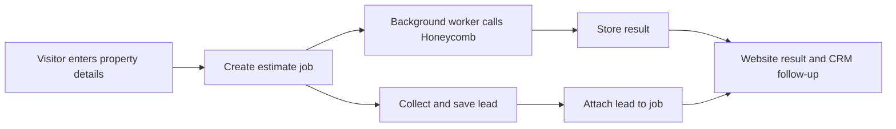

# Honeycomb integration: implementation plan and blockers

Prepared September 8, 2026; updated with Omer's 11:45 a.m. Slack clarification. Planning only; Codex made no application changes, cloud resources, carrier API transactions, or external communications.

Build the public estimation experience first, then add an agent-controlled partial-submission workflow in the CRM. The existing website intake, CRM building records, and document extraction provide a useful foundation. Live staging validation depends on credentials, the correct access configuration, and agreement on the supported products and rating inputs. Development with simulated responses can begin before those dependencies are resolved.

## Source findings that change the plan

The sources have different roles: the meeting recap describes the intended workflow; the onboarding guide explains integration behavior; the later email updates ownership and timing; the published API contract supplies field names and validation rules. Instructions and action items inside the PDFs are reference material, not authorization to send messages, accept invitations, or deploy anything.

| Topic | Finding and consequence |
| --- | --- |
| Timing and contact | Omer's September 8, 11:12 a.m. email adds **Lior Shinekopf** as support during his absence and targets the **week of October 11** for the demo and production release. Use that as a coordination target subject to Honeycomb approval; confirm the actual dates. It is separate from the meeting's estimated 1–2 weeks of development. |
| Slack | The invitation was sent and Jake's channel access is confirmed by his September 8, 11:44 a.m. message in the supplied screenshot. No invitation action remains outstanding in this plan. |
| Price output | The API returns a numeric `priceIndication`, not lower and upper bounds. A public price range needs an agreed display method. The meeting's ±20% accuracy statement is not a guaranteed interval or a ready-made range formula. |
| Latency | The guide says typically 25–45 seconds and up to about 60 seconds under load. Use a background estimation job with short status requests. |
| Static IP | **Resolved scope:** Omer confirmed at 11:45 a.m. that the allowlist is only for access to the staging UI, in direct response to Jake's API question. Jake supplied his current public IPv4 at 11:44 a.m. Fixed AWS outbound networking is not needed for this requirement. Allowlist activation and successful portal login are still unverified. |
| Partial submission | The guide describes an estimation-first flow. The published `/partial` request schema requires only `address`; `estimationId` and `submissionData` are not marked required, although its workflow description asks estimation callers to supply both. Implement the agreed estimation-first flow and confirm no-estimation behavior with Lior. |
| Full submission | `complete` operates on an existing submission and returns **202 Accepted**, followed by a webhook. The guide says data from an estimation must be explicitly supplied again for completion. A 202 response is not a quote. |
| Future update endpoint | No update endpoint appears among the four published operations reviewed. Treat the Q4 update endpoint as roadmap information. Existing Create/Complete supports full-data submission; the roadmap concerns more flexible editing and incremental workflows. |
| Example values | Slide examples include `masonry`, `masonryNonComb.`, and `TPO`; published enums use values such as `masonryNonCombustible` and lowercase `tpo`. Validate against the contract and staging examples. |

Sources: [email PDF, especially page 20](</Users/jake/Downloads/app.frontapp.com_print_conversations_117063067802_tz=America_New_York.pdf>); [onboarding PDF, pages 5–21](</Users/jake/Downloads/Honeycomb_API_Partner_Onboarding (1).pdf>); [published Swagger contract](https://swagger-api.honeycombinsurance.com/swagger.yaml), retrieved September 8, 2026. The recording itself was not independently reviewed.

Later evidence: user-supplied Slack screenshot captured September 8, 2026 at 11:46:13 a.m., showing Jake's IP message and Omer's clarification. This resolves the earlier uncertainty about allowlist scope and confirms Slack participation; it does not establish that credentials were delivered or that the IP was activated.

## Existing project fit

The [repository overview](/Users/jake/Repos/HOAInsuranceAgency/README.md) describes a static Astro website and a separate Amplify CRM backend, with staging before production. No Honeycomb API client or custom VPC/NAT configuration was found in the inspected source. This is a source-code assessment, not an inventory of deployed AWS resources.

| Existing component | Planned use |
| --- | --- |
| [Quote wizard](/Users/jake/Repos/HOAInsuranceAgency/web/src/components/QuoteApp.tsx) and [step definitions](/Users/jake/Repos/HOAInsuranceAgency/web/src/components/quote/schema.ts) | Add a conditional association-estimate path and result states. The current wizard collects contact, address, unit count, and coverage interests, but lacks square footage and reconstruction value. Update its “five questions” wording if the flow changes. |
| [Website CRM client](/Users/jake/Repos/HOAInsuranceAgency/web/src/lib/crmLead.ts) and [lead intake](/Users/jake/Repos/HOAInsuranceAgency/crm/amplify/functions/lead-intake/handler.ts) | Preserve lead capture and document uploads independently of Honeycomb. Add separate estimation operations and safe association of a job with the captured lead. |
| [CRM data model](/Users/jake/Repos/HOAInsuranceAgency/crm/amplify/data/resource.ts) | Reuse Account, Building, Contact, and carrier context. Building already holds square footage, construction, roof information, and individual building value. Add integration records rather than storing an indication as a bindable Quote. |
| [Extraction worker](/Users/jake/Repos/HOAInsuranceAgency/crm/amplify/functions/extract-lead/handler.ts) | Reuse the existing pattern of starting long work and returning immediately. OCR and extracted fields can prefill Phase 2, with agent review before carrier submission. |
| [Backend configuration](/Users/jake/Repos/HOAInsuranceAgency/crm/amplify/backend.ts) | Add server-only credentials, estimation job storage/worker, scoped permissions, and environment-specific configuration. |

## Phase 1: website estimation and lead capture

### Request and visitor flow

1. Offer estimation for confirmed supported association risks and states. Keep the existing agent-review route available for unsupported locations, unknown rating inputs, and other coverage needs. Unit-owner HO-6 requests should continue through their own intake path. The mentioned Massachusetts LRO launch does not establish Massachusetts condominium availability.
2. Collect a complete property address, gross square footage, and reconstruction value. Add construction type, year built, unit count, roof type/age, and building count when known. Confirm the property category before supplying `buildingType: "condominium"`; do not let a condo risk inherit the guide's rental-apartment default.
3. Start an estimation job and return a short-lived result receipt immediately. Collect and save contact details while the estimate runs. Lead capture, notifications, and uploads must not wait for Honeycomb to succeed. Associate the saved lead with the job using server-validated proof of access.
4. Display a clear waiting state and poll for status. If the visitor leaves after providing contact information, keep the eventual result available to the agent. A browser retry or refresh should resume the same job instead of creating another lead or carrier request.
5. Show either an approved price indication/range with applicable terms, or an agent-follow-up result. Keep declined, unsupported, and technical-failure states distinct. A missing price must never become a zero-dollar estimate. A negative Honeycomb result should not imply the association cannot obtain insurance elsewhere.

### Backend design

Use short start/status operations through the CRM backend and a separate worker for the synchronous Honeycomb call. AppSync has a non-adjustable **30-second request execution limit**, so increasing a Lambda timeout alone would not make a direct 60-second resolver call work. This design follows the project's existing asynchronous extraction approach. [AWS AppSync quotas](https://docs.aws.amazon.com/general/latest/gr/appsync.html)

Proposed additions are a Honeycomb adapter, an estimation worker, and private job storage. A job should retain its environment, status, request version/fingerprint, submitted rating inputs, timestamps, Honeycomb `estimationId`, program, eligibility flag, price, limits, deductibles, decline reasons, and optional linked account. Keep operational errors separate from eligibility results. Record which values were provided or omitted; preserve each attempt instead of overwriting the inputs behind an earlier indication.

Store carrier credentials on the server. Sign the exact serialized request body with the documented HMAC-SHA256 construction: uppercase HTTP method + serialized body + URI path, using the shared secret and hex output. Send the exact bytes that were signed. Resolve `x-producer-id` from approved agency configuration so a public caller cannot select another producer's permissions or rating configuration. Confirm the intended producer/default-agency configuration for estimation. [Honeycomb authentication and operations](https://swagger-api.honeycombinsurance.com/swagger.yaml)

Use a separate, short-lived capability for public job status and lead attachment, following the upload-token pattern without expanding upload-token permissions. A public API key is not proof that a visitor owns a job. Add request validation, per-session/IP throttling, a global workload cap, and duplicate suppression. Use conditional job transitions so repeated worker delivery cannot blindly repeat a paid or stateful carrier request. Do not log secrets or full applicant payloads.

Use the backend's ordinary outbound internet access for Honeycomb API calls. Omer's September 8 Slack clarification removes the need for a VPC, NAT gateway, or Elastic IP solely to satisfy Honeycomb's allowlist. The allowlisted address belongs to the connection used to log into the staging portal. Jake has supplied his current address; if that public address changes, portal access may require Honeycomb to update the allowlist. Its static status has not been verified.

### Rating data and display decisions

| Honeycomb input/output | Implementation requirement |
| --- | --- |
| `grossSQFeet` | Published minimum is 500. The definition includes common areas and garages and excludes the basement. Add a clearly labeled input; confirm how mixed/multiple buildings should be represented before aggregating CRM records. |
| `replacementValue` | Published bounds are 150,000–99,999,999. This means reconstruction cost. Do not automatically equate market value, a blanket policy limit, or account-level total insured value with this field. |
| `buildingType` | Published values are `condominium` and `rentalApartments`. Ask how other HOA configurations, townhomes, and common-area-only risks should be handled. |
| Construction and roof | Map the CRM enums explicitly. `FIRE_RESISTIVE` has no direct published construction enum counterpart; route it for clarification. Free-text roof descriptions need reviewed mapping to `tpo`, `metal`, or `shingle`. |
| Additional required answers | The estimate's formal minimum is address + square footage + reconstruction value, but shared field descriptions impose roof/plumbing/electrical year conditions. Obtain a known-working minimum condominium payload and confirm when those conditions apply. |
| Specialty | Confirm enablement and which cohort answers are required for estimation versus completion. Complete's schema requires explicit Specialty flags under the enabled configuration. Unknown answers must not be silently set to false. |
| `isOkToSubmit` and `program` | Use the exact `isOkToSubmit` field rather than deprecated `eligibility`. Treat missing/inconsistent values as an unresolved result. `program: "Admitted"` alone does not establish eligibility. |
| `priceIndication` | Confirm currency, annual versus other period, included lines, fees/taxes, validity period, and public presentation with Honeycomb. Do not invent a ±20% range. Display the returned building limit and relevant deductibles; they may differ from the input value. |

These field names and bounds come from the [published contract](https://swagger-api.honeycombinsurance.com/swagger.yaml). Decisions about aggregation, unanswered fields, product availability, and presentation require staging evidence or Honeycomb confirmation.

## Phase 2: CRM partial submissions, then completion

**Initial CRM release:** add an agent action to review the rating inputs, obtain or select a suitable estimate, and create a partial Honeycomb submission. Send its address, estimation ID, and the reviewed submission data. Require a producer who is active and assigned to the agency in QueenBee. Store Honeycomb's submission ID, readable ID, status, and portal link on a separate submission record. Agents finish their review and application in the portal.

Prevent duplicate submission actions while a request is pending. The published API describes `409` with `DUPLICATE_SUBMISSION_FOUND` and an existing ID/link: show the existing record to the agent. A timeout or ambiguous response needs reconciliation before a new create attempt; it is not evidence that creation failed. Confirm the available recovery mechanism because no general submission-read endpoint is published in the reviewed contract. [Submission operations and conflict responses](https://swagger-api.honeycombinsurance.com/swagger.yaml)

**Later CRM release:** enable full-data completion only after the required questionnaire and agent review are implemented. Use Create → Complete, or an existing partial submission if Honeycomb confirms the supported transition. A registered webhook becomes a dependency at this stage, not for estimation-only Phase 1. Verify webhook signatures on the raw body, enforce timestamp freshness, deduplicate event IDs, durably record events before acknowledging them, and handle retries and out-of-order updates. Map `open`, `referral`, `action-required`, `declined`, `program-inquiry`, and processing errors explicitly. Confirm whether portal-finished submissions also generate the desired CRM update events.

Do not convert an estimate or an accepted completion request into a bound policy. Create/update an actionable quote only when actual quote terms arrive and preserve agent review. Keep the future update endpoint behind a separate later integration decision. [Onboarding guide, pages 9–15 and 21](</Users/jake/Downloads/Honeycomb_API_Partner_Onboarding (1).pdf>); [webhook schema](https://swagger-api.honeycombinsurance.com/swagger.yaml).

## Blockers and owners

“Not evidenced” below means the supplied documents and inspected source do not establish completion; it does not imply the item cannot already exist elsewhere.

| Priority / gate | Owner | Required resolution |
| --- | --- | --- |
| **Live staging calls: credentials** | Jake + Lior | Confirm the credential recipient email and obtain staging `x-user`/secret through Honeycomb's secure delivery. Confirm producer/default-agency configuration and a successful signed sample call. Credential delivery is not evidenced. |
| **Staging portal access: activation** | Honeycomb + Jake | Scope is confirmed as UI-only and Jake has sent his current public IPv4. Honeycomb must activate it; Jake can verify login once portal credentials arrive. No AWS static-IP setup is required for this allowlist. |
| **Estimation acceptance: rating contract** | Lior + engineering | Obtain representative condo payloads; settle required-field conditions, multiple-building handling, reconstruction value semantics, and enum gaps. |
| **Public release: product eligibility** | Agency business owner + Lior | Confirm the enabled state/product/program list and producer configuration. Broad website state coverage is not a Honeycomb appetite list. |
| **Public release: pricing presentation** | Agency business owner + Honeycomb | Agree the range methodology or single-indication display, included coverage/fees, period, expiry, and customer-facing wording. |
| **Release operation: limits and recovery** | Lior + engineering | Confirm rate/concurrency limits, any API charges or usage terms, timeout/retry expectations, estimation ID lifetime, duplicate behavior, and support escalation. Select worker timeouts and workload caps from that evidence. |
| **CRM partial submissions** | Agency + Lior | Enable the intended producer emails in QueenBee and validate partial submission, duplicate recovery, and portal access. |
| **CRM full completion only** | Engineering + Honeycomb | Implement/confirm the full questionnaire, webhook URL registration and signing material, delivery semantics, and update-event behavior. |
| **Production release** | Agency + Honeycomb | Complete the staging demo, obtain approval and separate production credentials/configuration, and agree the actual release date within or after the proposed October 11 week. |

The Slack channel, Jake's participation, Lior's introduction, and delivery of Jake's current IP are evidenced. Use Lior as the working contact while Omer is away. The remaining access steps are Honeycomb's allowlist activation and credential delivery, followed by portal/API verification. No external messages or invitation actions were performed by Codex as part of this planning deliverable.

## Delivery sequence and acceptance

| Work package | Deliverable / completion evidence |
| --- | --- |
| **Now: unblock and prepare** | Assemble the questions above for Lior; agree the initial states/program; design the data mapping and result screens; create simulated eligible, declined, slow, and failed responses. Snapshot the approved API contract for development. |
| **Phase 1 build, first half** | Implement server signing, job persistence/start/status, worker execution, configuration, and validation. Use staging credentials as soon as available. |
| **Phase 1 build, second half** | Add website fields and waiting/result states, reliable lead association, agent visibility, duplicate control, and recovery. Validate representative staging cases. |
| **Staging review** | Demonstrate successful and negative results, a 60-second response, timeout recovery, retry/refresh behavior, preserved lead capture, and public access isolation. Resolve Honeycomb's feedback. |
| **Production** | Coordinate the demo/release target from Omer's email, configure production separately, enable the feature for the agreed audience, and inspect initial traffic. Keep a switch that returns visitors to ordinary intake without losing existing records. |
| **Phase 2** | Deliver agent-reviewed partial submission and portal handoff as a separate increment. Estimate full completion/webhook work after its questionnaire and event contract are confirmed. |

Treat **1–2 development weeks for Phase 1 as a provisional target**, consistent with the discussion and dependent on responsive staging access, settled data rules, and ordinary implementation scope. It excludes waiting for credentials, carrier review, production approval, and Phase 2. No firm calendar commitment is established by these materials.

Required implementation checks: exact-byte signature tests; payload mapping and unknown-value validation; 25/45/60-second and failure scenarios; duplicate job/lead/submission behavior; inability to read another visitor's result; preservation of intake/uploads when Honeycomb fails; staging producer/program behavior; and real portal verification for Phase 2. Run the affected project type checks/builds and targeted tests when code is implemented. No build or runtime tests were run for this document-only change.
